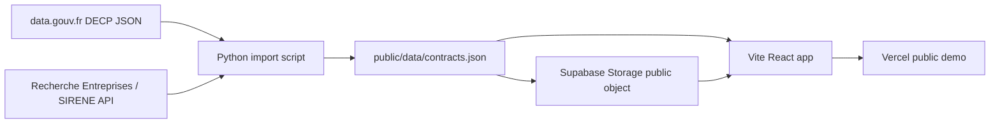

# Architecture

## Goal

PublicMoney Radar is a deliberately simple MVP: search real French public procurement data and open detail/profile pages without authentication.

## Components

## Frontend

- `src/main.tsx`: single React entry point, hash-based routing.
- `src/search.ts`: pure search and aggregation helpers.
- `src/types.ts`: shared contract types.
- `src/styles.css`: simple readable UI, no complex dashboard framework.

Routes:

- `#/`: search page
- `#/contract/:id`: contract detail, using the generated unique row id
- `#/supplier/:siret-or-name`: supplier/company profile
- `#/buyer/:id-or-name`: public buyer profile

## Data pipeline

- `scripts/import_decp_sample.py` downloads or reuses a cached DECP JSON file under `data/raw/`.
- It extracts the fields needed for the MVP.
- It strips HTML tags from titles.
- It handles wrapped and direct `titulaire` shapes.
- It enriches SIRET/SIREN names with the public Recherche Entreprises API.
- It generates a unique row `id` because original DECP market ids can repeat.
- It preserves the original DECP id as `decpId` and the sampled row position as `sourceRowIndex`.
- It writes a compact JSON payload to `public/data/contracts.json`.

## Supabase usage

The working production demo reads a generated JSON file from Supabase Storage. The same JSON file is committed under `public/data/contracts.json` for local development and reproducibility.

Because SQL admin access was not available during this build (`403 error code: 1010`), the Postgres schema was not applied. `supabase/schema.sql` documents the table-backed schema for the next iteration.

## Error handling

- Data loading failure is displayed as a user-visible error box.
- Missing routes show an “Introuvable” page.
- Missing amount/date/location values display explicit fallback text.
- Blank buyer/supplier identifiers fall back to name-based profile routes.

## Why not a complex dashboard?

The MVP prioritizes useful search and readable detail/profile pages. Visual analytics are limited to totals, rankings, keywords and yearly aggregates.
