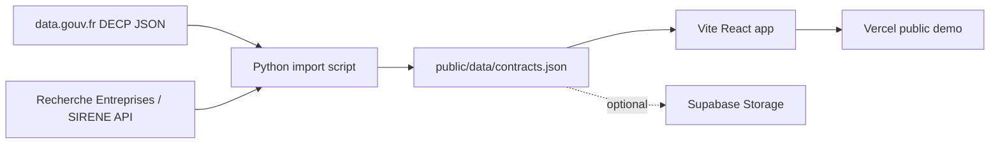

# Architecture

## Goal

PublicMoney Radar is a deliberately simple MVP: search real French public procurement data and open detail/profile pages without authentication.

## Components

## Frontend

- `src/main.tsx`: single React entry point, hash-based routing.
- `src/search.ts`: pure search and aggregation helpers.
- `src/types.ts`: shared contract types.
- `src/styles.css`: simple readable UI, no complex dashboard framework.

Routes:

- `#/`: search page
- `#/contract/:id`: contract detail
- `#/supplier/:siret`: supplier/company profile
- `#/buyer/:id`: public buyer profile

## Data pipeline

- `scripts/import_decp_sample.py` downloads a DECP JSON file.
- It extracts the fields needed for the MVP.
- It enriches SIRET/SIREN names with the public Recherche Entreprises API.
- It writes a compact JSON payload to `public/data/contracts.json`.

## Supabase usage

The intended V1 architecture is Supabase-backed storage. Because SQL admin access was not available during this build, the working demo reads a generated JSON file. The same file can be hosted in Supabase Storage and the app can read it through `VITE_SUPABASE_PUBLIC_DATA_URL`.

`supabase/schema.sql` documents the table-backed schema for the next iteration.

## Error handling

- Data loading failure is displayed as a user-visible error box.
- Missing routes show an “Introuvable” page.
- Missing amount/date/location values display explicit fallback text.

## Why not a complex dashboard?

The MVP prioritizes useful search and readable detail/profile pages. Visual analytics are limited to totals, rankings, keywords and yearly aggregates.
